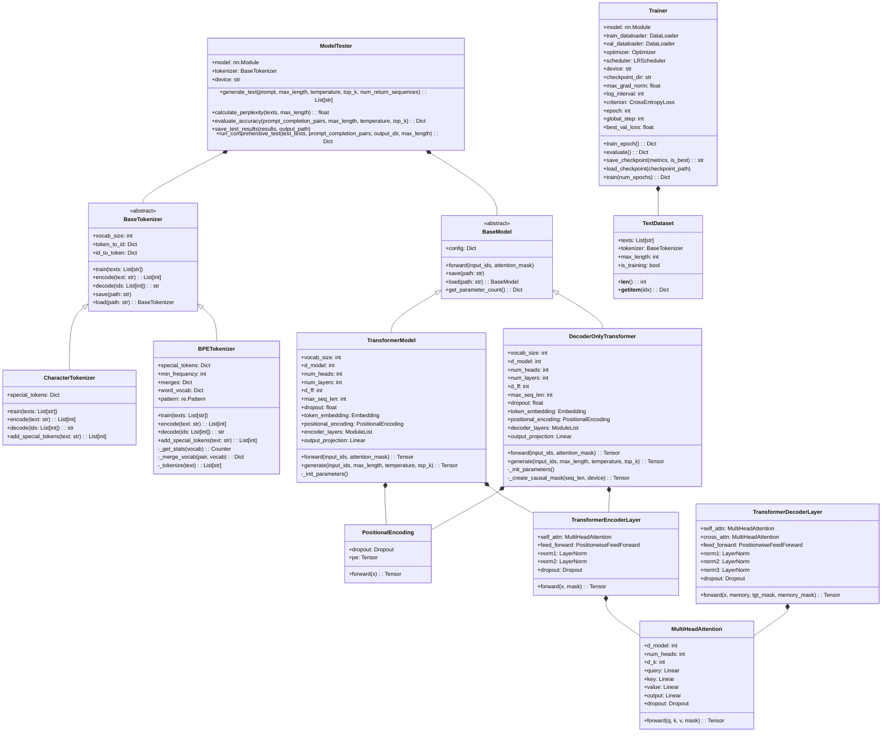

```mermaid
classDiagram
    %% Base Classes
    class BaseTokenizer {
        <<abstract>>
        +vocab_size: int
        +token_to_id: Dict
        +id_to_token: Dict
        +train(texts: List[str])
        +encode(text: str): List[int]
        +decode(ids: List[int]): str
        +save(path: str)
        +load(path: str): BaseTokenizer
    }
    
    class BaseModel {
        <<abstract>>
        +config: Dict
        +forward(input_ids, attention_mask)
        +save(path: str)
        +load(path: str): BaseModel
        +get_parameter_count(): Dict
    }
    
    %% Tokenizer Implementations
    class CharacterTokenizer {
        +special_tokens: Dict
        +train(texts: List[str])
        +encode(text: str): List[int]
        +decode(ids: List[int]): str
        +add_special_tokens(text: str): List[int]
    }
    
    class BPETokenizer {
        +special_tokens: Dict
        +min_frequency: int
        +merges: Dict
        +word_vocab: Dict
        +pattern: re.Pattern
        +train(texts: List[str])
        +encode(text: str): List[int]
        +decode(ids: List[int]): str
        +add_special_tokens(text: str): List[int]
        -_get_stats(vocab): Counter
        -_merge_vocab(pair, vocab): Dict
        -_tokenize(text): List[str]
    }
    
    %% Model Components
    class MultiHeadAttention {
        +d_model: int
        +num_heads: int
        +d_k: int
        +query: Linear
        +key: Linear
        +value: Linear
        +output: Linear
        +dropout: Dropout
        +forward(q, k, v, mask): Tensor
    }
    
    class PositionalEncoding {
        +dropout: Dropout
        +pe: Tensor
        +forward(x): Tensor
    }
    
    class TransformerEncoderLayer {
        +self_attn: MultiHeadAttention
        +feed_forward: PositionwiseFeedForward
        +norm1: LayerNorm
        +norm2: LayerNorm
        +dropout: Dropout
        +forward(x, mask): Tensor
    }
    
    class TransformerDecoderLayer {
        +self_attn: MultiHeadAttention
        +cross_attn: MultiHeadAttention
        +feed_forward: PositionwiseFeedForward
        +norm1: LayerNorm
        +norm2: LayerNorm
        +norm3: LayerNorm
        +dropout: Dropout
        +forward(x, memory, tgt_mask, memory_mask): Tensor
    }
    
    %% Model Implementations
    class TransformerModel {
        +vocab_size: int
        +d_model: int
        +num_heads: int
        +num_layers: int
        +d_ff: int
        +max_seq_len: int
        +dropout: float
        +token_embedding: Embedding
        +positional_encoding: PositionalEncoding
        +encoder_layers: ModuleList
        +output_projection: Linear
        +forward(input_ids, attention_mask): Tensor
        +generate(input_ids, max_length, temperature, top_k): Tensor
        -_init_parameters()
    }
    
    class DecoderOnlyTransformer {
        +vocab_size: int
        +d_model: int
        +num_heads: int
        +num_layers: int
        +d_ff: int
        +max_seq_len: int
        +dropout: float
        +token_embedding: Embedding
        +positional_encoding: PositionalEncoding
        +decoder_layers: ModuleList
        +output_projection: Linear
        +forward(input_ids, attention_mask): Tensor
        +generate(input_ids, max_length, temperature, top_k): Tensor
        -_init_parameters()
        -_create_causal_mask(seq_len, device): Tensor
    }
    
    %% Training Classes
    class TextDataset {
        +texts: List[str]
        +tokenizer: BaseTokenizer
        +max_length: int
        +is_training: bool
        +__len__(): int
        +__getitem__(idx): Dict
    }
    
    class Trainer {
        +model: nn.Module
        +train_dataloader: DataLoader
        +val_dataloader: DataLoader
        +optimizer: Optimizer
        +scheduler: LRScheduler
        +device: str
        +checkpoint_dir: str
        +max_grad_norm: float
        +log_interval: int
        +criterion: CrossEntropyLoss
        +epoch: int
        +global_step: int
        +best_val_loss: float
        +train_epoch(): Dict
        +evaluate(): Dict
        +save_checkpoint(metrics, is_best): str
        +load_checkpoint(checkpoint_path)
        +train(num_epochs): Dict
    }
    
    %% Testing Classes
    class ModelTester {
        +model: nn.Module
        +tokenizer: BaseTokenizer
        +device: str
        +generate_text(prompt, max_length, temperature, top_k, num_return_sequences): List[str]
        +calculate_perplexity(texts, max_length): float
        +evaluate_accuracy(prompt_completion_pairs, max_length, temperature, top_k): Dict
        +save_test_results(results, output_path)
        +run_comprehensive_test(test_texts, prompt_completion_pairs, output_dir, max_length): Dict
    }
    
    %% Inheritance Relationships
    BaseTokenizer <|-- CharacterTokenizer
    BaseTokenizer <|-- BPETokenizer
    BaseModel <|-- TransformerModel
    BaseModel <|-- DecoderOnlyTransformer
    
    %% Composition Relationships
    TransformerModel *-- PositionalEncoding
    TransformerModel *-- TransformerEncoderLayer
    DecoderOnlyTransformer *-- PositionalEncoding
    DecoderOnlyTransformer *-- TransformerEncoderLayer
    TransformerEncoderLayer *-- MultiHeadAttention
    TransformerDecoderLayer *-- MultiHeadAttention
    Trainer *-- TextDataset
    ModelTester *-- BaseModel
    ModelTester *-- BaseTokenizer
```
