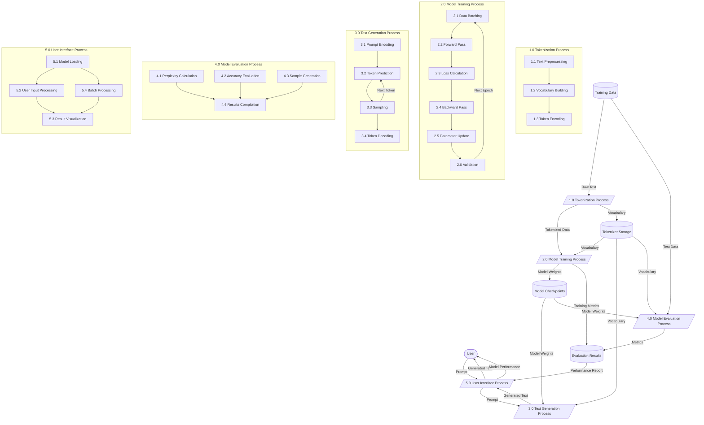

```mermaid
flowchart TD
    %% Data Flow Diagram
    
    %% External Entities
    User([User])
    TrainingData[(Training Data)]
    
    %% Processes
    Tokenization[/"1.0 Tokenization Process"/]
    ModelTraining[/"2.0 Model Training Process"/]
    TextGeneration[/"3.0 Text Generation Process"/]
    ModelEvaluation[/"4.0 Model Evaluation Process"/]
    UserInterface[/"5.0 User Interface Process"/]
    
    %% Data Stores
    TokenizerStore[(Tokenizer Storage)]
    ModelStore[(Model Checkpoints)]
    ResultsStore[(Evaluation Results)]
    
    %% Data Flows
    
    %% Tokenization Process
    TrainingData -->|Raw Text| Tokenization
    Tokenization -->|Tokenized Data| ModelTraining
    Tokenization -->|Vocabulary| TokenizerStore
    
    %% Model Training Process
    TokenizerStore -->|Vocabulary| ModelTraining
    ModelTraining -->|Model Weights| ModelStore
    ModelTraining -->|Training Metrics| ResultsStore
    
    %% Text Generation Process
    User -->|Prompt| UserInterface
    UserInterface -->|Prompt| TextGeneration
    TokenizerStore -->|Vocabulary| TextGeneration
    ModelStore -->|Model Weights| TextGeneration
    TextGeneration -->|Generated Text| UserInterface
    UserInterface -->|Generated Text| User
    
    %% Model Evaluation Process
    TrainingData -->|Test Data| ModelEvaluation
    TokenizerStore -->|Vocabulary| ModelEvaluation
    ModelStore -->|Model Weights| ModelEvaluation
    ModelEvaluation -->|Metrics| ResultsStore
    ResultsStore -->|Performance Report| UserInterface
    UserInterface -->|Model Performance| User
    
    %% Subprocesses
    
    %% 1.0 Tokenization Process
    subgraph Tokenization_Detail [1.0 Tokenization Process]
        direction TB
        T1[1.1 Text Preprocessing]
        T2[1.2 Vocabulary Building]
        T3[1.3 Token Encoding]
        
        T1 --> T2 --> T3
    end
    
    %% 2.0 Model Training Process
    subgraph Training_Detail [2.0 Model Training Process]
        direction TB
        M1[2.1 Data Batching]
        M2[2.2 Forward Pass]
        M3[2.3 Loss Calculation]
        M4[2.4 Backward Pass]
        M5[2.5 Parameter Update]
        M6[2.6 Validation]
        
        M1 --> M2 --> M3 --> M4 --> M5 --> M6
        M6 -->|Next Epoch| M1
    end
    
    %% 3.0 Text Generation Process
    subgraph Generation_Detail [3.0 Text Generation Process]
        direction TB
        G1[3.1 Prompt Encoding]
        G2[3.2 Token Prediction]
        G3[3.3 Sampling]
        G4[3.4 Token Decoding]
        
        G1 --> G2 --> G3 --> G4
        G3 -->|Next Token| G2
    end
    
    %% 4.0 Model Evaluation Process
    subgraph Evaluation_Detail [4.0 Model Evaluation Process]
        direction TB
        E1[4.1 Perplexity Calculation]
        E2[4.2 Accuracy Evaluation]
        E3[4.3 Sample Generation]
        E4[4.4 Results Compilation]
        
        E1 & E2 & E3 --> E4
    end
    
    %% 5.0 User Interface Process
    subgraph UI_Detail [5.0 User Interface Process]
        direction TB
        U1[5.1 Model Loading]
        U2[5.2 User Input Processing]
        U3[5.3 Result Visualization]
        U4[5.4 Batch Processing]
        
        U1 --> U2 --> U3
        U1 --> U4 --> U3
    end
```
