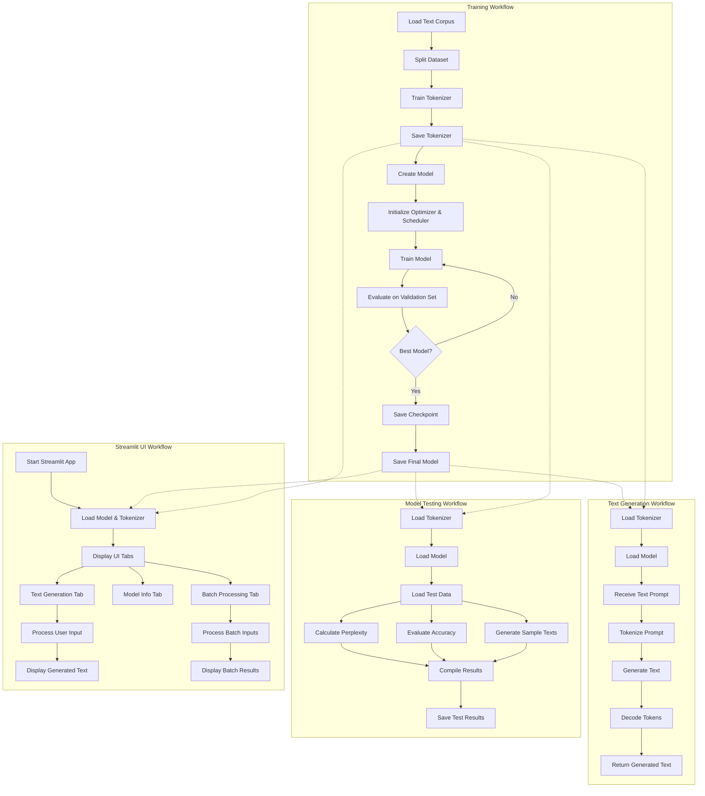

```mermaid
flowchart TD
    %% Main Training Workflow
    subgraph Training["Training Workflow"]
        A[Load Text Corpus] --> B[Split Dataset]
        B --> C[Train Tokenizer]
        C --> D[Save Tokenizer]
        D --> E[Create Model]
        E --> F[Initialize Optimizer & Scheduler]
        F --> G[Train Model]
        G --> H[Evaluate on Validation Set]
        H --> I{Best Model?}
        I -->|Yes| J[Save Checkpoint]
        I -->|No| G
        J --> K[Save Final Model]
    end
    
    %% Text Generation Workflow
    subgraph Generation["Text Generation Workflow"]
        L[Load Tokenizer] --> M[Load Model]
        M --> N[Receive Text Prompt]
        N --> O[Tokenize Prompt]
        O --> P[Generate Text]
        P --> Q[Decode Tokens]
        Q --> R[Return Generated Text]
    end
    
    %% Testing Workflow
    subgraph Testing["Model Testing Workflow"]
        S[Load Tokenizer] --> T[Load Model]
        T --> U[Load Test Data]
        U --> V[Calculate Perplexity]
        U --> W[Evaluate Accuracy]
        U --> X[Generate Sample Texts]
        V & W & X --> Y[Compile Results]
        Y --> Z[Save Test Results]
    end
    
    %% UI Workflow
    subgraph UI["Streamlit UI Workflow"]
        AA[Start Streamlit App] --> AB[Load Model & Tokenizer]
        AB --> AC[Display UI Tabs]
        AC --> AD[Text Generation Tab]
        AC --> AE[Model Info Tab]
        AC --> AF[Batch Processing Tab]
        AD --> AG[Process User Input]
        AG --> AH[Display Generated Text]
        AF --> AI[Process Batch Inputs]
        AI --> AJ[Display Batch Results]
    end
    
    %% Connections between workflows
    K -.-> S
    K -.-> L
    K -.-> AB
    D -.-> S
    D -.-> L
    D -.-> AB
```
